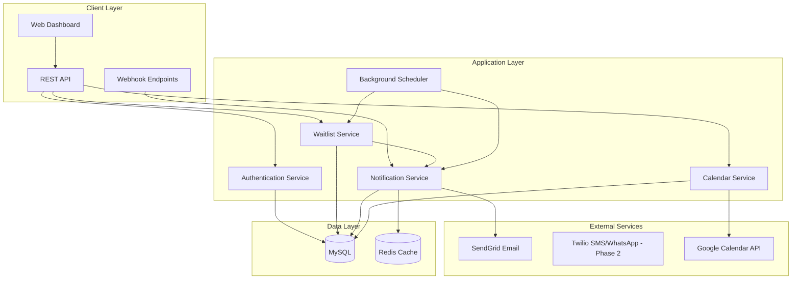

# Design Document

## Overview

The Waitlist Management System is a multi-tenant SaaS application that automates the process of filling last-minute cancellations for service-based businesses. The system uses a priority-based matching algorithm to connect available slots with waitlisted customers through automated notifications via SMS, WhatsApp, and email.

The architecture follows a microservices-inspired approach with clear separation between the web application, notification services, and background job processing, all built on a robust MySQL foundation with application-level tenant isolation.

## Architecture

### High-Level Architecture



### Technology Stack

- **Frontend**: React with TypeScript and Tailwind CSS for modern, responsive UI development
- **Backend**: Node.js with Express.js framework for rapid development and extensive ecosystem
- **Database**: MySQL with multi-tenant data isolation using tenant_id filtering
- **Cache**: Redis for session management and rate limiting
- **Messaging**: SendGrid for email notifications (SMS/WhatsApp via Twilio in Phase 2)
- **Authentication**: JWT tokens with tenant-scoped permissions
- **Background Jobs**: Node.js worker processes with Redis-backed job queue
- **Hosting**: Render or Fly.io for containerized deployment

## Components and Interfaces

### Core Services

#### Authentication Service
- **Purpose**: Handle JWT token generation, validation, and tenant-scoped authorization
- **Key Methods**:
  - `generateToken(userId, tenantId)`: Creates signed JWT with tenant context
  - `validateToken(token)`: Verifies token and extracts tenant/user info
  - `checkTenantAccess(userId, tenantId)`: Ensures user has access to tenant resources

#### Waitlist Service
- **Purpose**: Manage waitlist entries, priority scoring, and candidate matching
- **Key Methods**:
  - `addToWaitlist(customerData, preferences)`: Creates new waitlist entry with validation
  - `calculatePriority(entry, slot)`: Computes priority score using business rules
  - `findCandidates(slot)`: Returns ranked list of eligible waitlist entries
  - `removeFromWaitlist(entryId, reason)`: Deactivates entry with audit trail

#### Notification Service
- **Purpose**: Handle email messaging with delivery tracking and rate limiting (SMS/WhatsApp in Phase 2)
- **Key Methods**:
  - `sendEmailNotification(entry, slot)`: Dispatches email notification via SendGrid
  - `generateConfirmToken(entryId, slotId)`: Creates secure confirmation link
  - `processConfirmation(token, action)`: Handles confirm/decline responses
  - `checkRateLimit(tenantId)`: Enforces notification quotas

#### Slot Management Service
- **Purpose**: Manage slot lifecycle, holds, and booking state transitions
- **Key Methods**:
  - `createSlot(staffId, serviceId, timeRange)`: Creates new available slot
  - `markSlotOpen(slotId)`: Triggers waitlist matching process
  - `holdSlot(slotId, entryId, duration)`: Places temporary hold with expiration
  - `bookSlot(slotId, customerData)`: Finalizes booking and updates calendar

### API Endpoints

#### Waitlist Management
```
POST /api/waitlist
- Creates new waitlist entry with phone verification for new numbers
- Validates service/staff availability and time window constraints
- Returns entry ID and estimated position in queue

GET /api/waitlist?status=active&service_id=123
- Retrieves filtered waitlist entries for business dashboard
- Supports pagination and sorting by priority/created date

DELETE /api/waitlist/{entryId}
- Removes customer from waitlist with reason tracking
```

#### Slot Operations
```
POST /api/slots
- Creates new slot with staff, service, and time assignment
- Validates against business hours and existing bookings

POST /api/slots/{slotId}/open
- Marks slot as available and triggers automated matching
- Returns immediate feedback on candidate availability

GET /api/slots?date=2024-01-15&staff_id=456
- Retrieves slots for calendar display with filtering options
```

#### Confirmation Handling
```
POST /api/confirm/{token}
- Processes customer confirmation with token validation
- Handles race conditions for simultaneous confirmations
- Returns booking confirmation or "slot unavailable" message

POST /api/decline/{token}
- Records customer decline and triggers next candidate notification
- Updates waitlist entry status for analytics tracking
```

## Data Models

### Database Schema Design

The system uses MySQL with application-level tenant isolation. Each table includes a `tenant_id` column and all queries are filtered by tenant context at the application layer to ensure data isolation between tenants.

#### Core Tables

**tenants**
```sql
CREATE TABLE tenants (
    id CHAR(36) PRIMARY KEY DEFAULT (UUID()),
    name VARCHAR(255) NOT NULL,
    timezone VARCHAR(50) NOT NULL DEFAULT 'UTC',
    created_at TIMESTAMP DEFAULT CURRENT_TIMESTAMP
);
```

**staff**
```sql
CREATE TABLE staff (
    id CHAR(36) PRIMARY KEY DEFAULT (UUID()),
    tenant_id CHAR(36) NOT NULL,
    name VARCHAR(255) NOT NULL,
    role VARCHAR(100),
    active BOOLEAN DEFAULT true,
    created_at TIMESTAMP DEFAULT CURRENT_TIMESTAMP,
    FOREIGN KEY (tenant_id) REFERENCES tenants(id),
    INDEX idx_staff_tenant (tenant_id)
);
```

**services**
```sql
CREATE TABLE services (
    id CHAR(36) PRIMARY KEY DEFAULT (UUID()),
    tenant_id CHAR(36) NOT NULL,
    name VARCHAR(255) NOT NULL,
    duration_minutes INTEGER NOT NULL,
    price DECIMAL(10,2),
    active BOOLEAN DEFAULT true,
    FOREIGN KEY (tenant_id) REFERENCES tenants(id),
    INDEX idx_services_tenant (tenant_id)
);
```

**slots**
```sql
CREATE TABLE slots (
    id CHAR(36) PRIMARY KEY DEFAULT (UUID()),
    tenant_id CHAR(36) NOT NULL,
    staff_id CHAR(36) NOT NULL,
    service_id CHAR(36) NOT NULL,
    start_time TIMESTAMP NOT NULL,
    end_time TIMESTAMP NOT NULL,
    status ENUM('open', 'held', 'booked', 'canceled') NOT NULL,
    hold_expires_at TIMESTAMP NULL,
    created_at TIMESTAMP DEFAULT CURRENT_TIMESTAMP,
    FOREIGN KEY (tenant_id) REFERENCES tenants(id),
    FOREIGN KEY (staff_id) REFERENCES staff(id),
    FOREIGN KEY (service_id) REFERENCES services(id),
    INDEX idx_slots_tenant (tenant_id),
    INDEX idx_slots_time (start_time, end_time),
    INDEX idx_slots_status (status)
);
```

**waitlist_entries**
```sql
CREATE TABLE waitlist_entries (
    id CHAR(36) PRIMARY KEY DEFAULT (UUID()),
    tenant_id CHAR(36) NOT NULL,
    customer_name VARCHAR(255) NOT NULL,
    phone VARCHAR(20) NOT NULL,
    email VARCHAR(255),
    service_id CHAR(36) NOT NULL,
    staff_id CHAR(36) NULL, -- nullable for any staff preference
    earliest_time TIMESTAMP NOT NULL,
    latest_time TIMESTAMP NOT NULL,
    priority_score INTEGER NOT NULL,
    vip_status BOOLEAN DEFAULT false,
    status ENUM('active', 'notified', 'confirmed', 'removed') NOT NULL,
    created_at TIMESTAMP DEFAULT CURRENT_TIMESTAMP,
    FOREIGN KEY (tenant_id) REFERENCES tenants(id),
    FOREIGN KEY (service_id) REFERENCES services(id),
    FOREIGN KEY (staff_id) REFERENCES staff(id),
    INDEX idx_waitlist_tenant (tenant_id),
    INDEX idx_waitlist_status (status),
    INDEX idx_waitlist_priority (priority_score DESC, created_at ASC)
);
```

#### Priority Scoring Algorithm

The priority score is calculated using the following weighted formula:
- Base score: 20 points
- VIP status: +15 points
- Service match: +15 points (always true for candidates)
- Staff preference match: +10 points (when preferred staff is available)
- Time window compatibility: +10 points (when slot falls within preferred window)
- Recency bonus: +1 point per week on waitlist (capped at 20 points)

### Tenant Isolation Implementation

Since MySQL doesn't have row-level security like PostgreSQL, tenant isolation is implemented at the application layer:

```javascript
// Application-level tenant filtering in repository base class
class BaseRepository {
  constructor(tenantId) {
    this.tenantId = tenantId;
  }
  
  // All queries automatically include tenant_id filter
  async findAll(conditions = {}) {
    return this.db.select('*')
      .from(this.tableName)
      .where({ tenant_id: this.tenantId, ...conditions });
  }
  
  async create(data) {
    return this.db.insert({ ...data, tenant_id: this.tenantId })
      .into(this.tableName);
  }
}

// Middleware extracts tenant_id from JWT and creates scoped repositories
app.use((req, res, next) => {
  const { tenantId } = jwt.verify(req.headers.authorization);
  req.repositories = {
    waitlist: new WaitlistRepository(tenantId),
    slots: new SlotRepository(tenantId),
    // ... other repositories
  };
  next();
});
```

## Error Handling

### Graceful Degradation Strategy

1. **Notification Failures**: If email delivery fails, retry up to 3 times with exponential backoff
2. **Calendar Sync Issues**: Log errors but continue with internal slot management to avoid blocking core functionality
3. **Rate Limit Exceeded**: Queue notifications for next available window rather than dropping them
4. **Database Connectivity**: Implement connection pooling with automatic retry and circuit breaker patterns

### Error Response Format

```json
{
    "error": {
        "code": "WAITLIST_LIMIT_EXCEEDED",
        "message": "Maximum 3 active waitlist entries allowed per phone number",
        "details": {
            "current_count": 3,
            "phone": "+1234567890"
        }
    }
}
```

### Critical Error Scenarios

- **Double Booking Prevention**: Use database unique constraints on `(slot_id, status='booked')` to prevent race conditions
- **Token Expiry Handling**: Validate token timestamps before processing confirmations and provide clear user feedback
- **Hold Expiration**: Background worker checks every minute for expired holds and automatically releases them

## Testing Strategy

### Unit Testing
- **Service Layer**: Mock external dependencies (Twilio, SendGrid) and test business logic in isolation
- **Priority Algorithm**: Comprehensive test cases covering all scoring scenarios and edge cases
- **Token Generation**: Verify cryptographic security and expiration handling
- **Database Queries**: Test complex queries with various data scenarios

### Integration Testing
- **API Endpoints**: Test complete request/response cycles with real database transactions
- **Webhook Processing**: Simulate Twilio/SendGrid webhook payloads and verify correct handling
- **Background Jobs**: Test slot expiration and notification cascade workflows
- **Multi-tenant Isolation**: Verify RLS policies prevent cross-tenant data access

### End-to-End Testing
- **Complete Waitlist Flow**: Customer signup → slot opens → notification → confirmation → booking
- **Cascade Scenarios**: Test notification chain when multiple customers decline
- **Calendar Integration**: Verify Google Calendar events are created/deleted correctly
- **Rate Limiting**: Test notification throttling under high load

### Performance Testing
- **Database Queries**: Ensure candidate matching queries perform well with large waitlists
- **Concurrent Confirmations**: Test race condition handling with simultaneous booking attempts
- **Notification Throughput**: Verify system can handle peak notification volumes
- **Memory Usage**: Monitor background worker memory consumption during long-running operations

### Security Testing
- **JWT Validation**: Test token tampering and expiration scenarios
- **SQL Injection**: Verify parameterized queries prevent injection attacks
- **Rate Limiting**: Test API endpoint abuse prevention
- **Cross-tenant Access**: Attempt unauthorized access to other tenant data