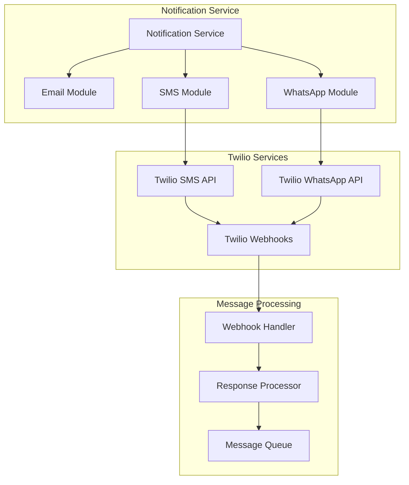

# Phase 2 Roadmap: SMS/WhatsApp Integration via Twilio

## Overview

Phase 2 of the Waitlist Management System focuses on expanding notification channels beyond email to include SMS and WhatsApp messaging through Twilio integration. This enhancement will significantly improve customer engagement and response rates by meeting customers where they prefer to communicate.

## Business Objectives

### Primary Goals
- **Increase Response Rates**: SMS has 98% open rates vs 20% for email
- **Reduce No-Shows**: Immediate notifications lead to better commitment
- **Expand Market Reach**: Support customers who prefer mobile communication
- **Improve Accessibility**: Serve customers with limited email access

### Success Metrics
- 40% increase in waitlist confirmation rates
- 25% reduction in no-show rates
- 60% of customers prefer SMS/WhatsApp over email
- 15% increase in overall customer satisfaction

## Technical Architecture

### Twilio Integration Components



### Multi-Channel Notification Flow

1. **Channel Selection**: Customer chooses preferred notification method during waitlist signup
2. **Fallback Logic**: If primary channel fails, automatically try secondary channel
3. **Response Handling**: Process "YES"/"NO" text responses and WhatsApp button clicks
4. **Delivery Tracking**: Monitor delivery status across all channels

## Feature Specifications

### 1. SMS Integration

#### Core Features
- **SMS Notifications**: Send slot availability notifications via SMS
- **Two-Way Messaging**: Handle "YES"/"NO" text responses
- **Delivery Tracking**: Monitor SMS delivery status and failures
- **Rate Limiting**: Respect carrier limits and avoid spam classification

#### Technical Implementation
```typescript
interface SMSNotification {
  to: string;
  message: string;
  confirmKeyword: string;
  declineKeyword: string;
  expiryTime: Date;
}

class SMSService {
  async sendSlotNotification(entry: WaitlistEntry, slot: Slot): Promise<SMSResult>
  async handleIncomingMessage(from: string, body: string): Promise<void>
  async getDeliveryStatus(messageSid: string): Promise<DeliveryStatus>
}
```

#### Message Templates
```
🎯 Slot Available!

Hi [NAME], a [SERVICE] slot just opened:
📅 [DATE] at [TIME]
👩‍💼 with [STAFF]
💰 $[PRICE]

Reply YES to book or NO to pass.
Expires in 10 minutes.

[BUSINESS_NAME]
```

### 2. WhatsApp Business Integration

#### Core Features
- **Rich Messages**: Send formatted messages with buttons and images
- **Interactive Buttons**: "Confirm" and "Decline" buttons for easy response
- **Business Profile**: Professional WhatsApp Business presence
- **Template Management**: Pre-approved message templates

#### Technical Implementation
```typescript
interface WhatsAppMessage {
  to: string;
  template: string;
  parameters: Record<string, string>;
  buttons: WhatsAppButton[];
}

interface WhatsAppButton {
  type: 'quick_reply' | 'url';
  title: string;
  payload?: string;
  url?: string;
}

class WhatsAppService {
  async sendTemplateMessage(message: WhatsAppMessage): Promise<WhatsAppResult>
  async handleWebhook(payload: WhatsAppWebhook): Promise<void>
  async getTemplateStatus(templateName: string): Promise<TemplateStatus>
}
```

#### WhatsApp Template Example
```
✨ *Slot Available at [BUSINESS_NAME]*

Hi [NAME]! 👋

A *[SERVICE]* appointment just opened:
📅 *Date:* [DATE]
⏰ *Time:* [TIME]  
👩‍💼 *Staff:* [STAFF]
💰 *Price:* $[PRICE]

This offer expires in *10 minutes*.

[CONFIRM_BUTTON] [DECLINE_BUTTON]
```

### 3. Multi-Channel Notification System

#### Channel Priority Logic
```typescript
interface NotificationPreferences {
  primary: 'email' | 'sms' | 'whatsapp';
  secondary?: 'email' | 'sms' | 'whatsapp';
  fallback?: 'email' | 'sms' | 'whatsapp';
}

class MultiChannelNotificationService {
  async sendNotification(
    entry: WaitlistEntry, 
    slot: Slot, 
    preferences: NotificationPreferences
  ): Promise<NotificationResult>
  
  async handleFailover(
    originalChannel: string, 
    entry: WaitlistEntry, 
    slot: Slot
  ): Promise<void>
}
```

#### Delivery Tracking
- Real-time delivery status updates
- Failed delivery retry logic with exponential backoff
- Channel performance analytics
- Customer response time tracking

### 4. Response Processing System

#### Webhook Handling
```typescript
interface IncomingMessage {
  from: string;
  body: string;
  channel: 'sms' | 'whatsapp';
  timestamp: Date;
  messageId: string;
}

class ResponseProcessor {
  async processIncomingMessage(message: IncomingMessage): Promise<void>
  async validateResponse(message: IncomingMessage): Promise<boolean>
  async executeAction(action: 'confirm' | 'decline', context: any): Promise<void>
}
```

#### Response Validation
- Keyword matching for SMS responses
- Button payload validation for WhatsApp
- Time-based response validation (within hold period)
- Duplicate response prevention

## Implementation Plan

### Phase 2.1: SMS Integration (4 weeks)

#### Week 1: Foundation
- [ ] Set up Twilio account and phone number
- [ ] Implement SMS service class
- [ ] Create SMS message templates
- [ ] Set up webhook endpoints

#### Week 2: Core SMS Features
- [ ] Implement SMS notification sending
- [ ] Build incoming SMS webhook handler
- [ ] Add SMS response processing
- [ ] Create SMS delivery tracking

#### Week 3: Integration & Testing
- [ ] Integrate SMS with existing notification service
- [ ] Implement fallback logic
- [ ] Add SMS preferences to user signup
- [ ] Write comprehensive tests

#### Week 4: Polish & Deploy
- [ ] Performance optimization
- [ ] Error handling improvements
- [ ] Documentation updates
- [ ] Staging deployment and testing

### Phase 2.2: WhatsApp Integration (4 weeks)

#### Week 1: WhatsApp Setup
- [ ] Apply for WhatsApp Business API access
- [ ] Create and submit message templates
- [ ] Set up WhatsApp webhook endpoints
- [ ] Implement WhatsApp service class

#### Week 2: Template & Messaging
- [ ] Build template message system
- [ ] Implement interactive button handling
- [ ] Create WhatsApp webhook processor
- [ ] Add rich media support (images, formatting)

#### Week 3: Advanced Features
- [ ] Implement WhatsApp Business Profile
- [ ] Add template management dashboard
- [ ] Build WhatsApp analytics tracking
- [ ] Create customer preference management

#### Week 4: Integration & Testing
- [ ] Integrate with multi-channel system
- [ ] Comprehensive testing across channels
- [ ] Performance optimization
- [ ] Production deployment

### Phase 2.3: Enhanced Features (3 weeks)

#### Week 1: Analytics & Reporting
- [ ] Channel performance dashboard
- [ ] Response rate analytics by channel
- [ ] Customer preference insights
- [ ] A/B testing framework for messages

#### Week 2: Advanced Automation
- [ ] Smart channel selection based on customer behavior
- [ ] Automated follow-up sequences
- [ ] Timezone-aware message scheduling
- [ ] Bulk messaging capabilities

#### Week 3: Mobile App Integration
- [ ] Push notification integration
- [ ] In-app messaging system
- [ ] Mobile-optimized confirmation flows
- [ ] Offline message queuing

## Technical Requirements

### Infrastructure Changes

#### Database Schema Updates
```sql
-- Add notification preferences to waitlist entries
ALTER TABLE waitlist_entries ADD COLUMN notification_preferences JSON;
ALTER TABLE waitlist_entries ADD COLUMN phone_verified BOOLEAN DEFAULT FALSE;

-- Create message tracking table
CREATE TABLE message_logs (
    id CHAR(36) PRIMARY KEY DEFAULT (UUID()),
    tenant_id CHAR(36) NOT NULL,
    waitlist_entry_id CHAR(36),
    channel ENUM('email', 'sms', 'whatsapp') NOT NULL,
    message_type ENUM('notification', 'reminder', 'confirmation') NOT NULL,
    recipient VARCHAR(255) NOT NULL,
    message_content TEXT,
    external_id VARCHAR(255), -- Twilio message SID
    status ENUM('sent', 'delivered', 'failed', 'read') NOT NULL,
    sent_at TIMESTAMP DEFAULT CURRENT_TIMESTAMP,
    delivered_at TIMESTAMP NULL,
    read_at TIMESTAMP NULL,
    error_message TEXT NULL,
    FOREIGN KEY (tenant_id) REFERENCES tenants(id),
    FOREIGN KEY (waitlist_entry_id) REFERENCES waitlist_entries(id),
    INDEX idx_message_logs_tenant (tenant_id),
    INDEX idx_message_logs_status (status),
    INDEX idx_message_logs_sent_at (sent_at)
);

-- Create response tracking table
CREATE TABLE message_responses (
    id CHAR(36) PRIMARY KEY DEFAULT (UUID()),
    tenant_id CHAR(36) NOT NULL,
    message_log_id CHAR(36) NOT NULL,
    response_text TEXT,
    response_type ENUM('confirm', 'decline', 'unknown') NOT NULL,
    processed_at TIMESTAMP DEFAULT CURRENT_TIMESTAMP,
    FOREIGN KEY (tenant_id) REFERENCES tenants(id),
    FOREIGN KEY (message_log_id) REFERENCES message_logs(id)
);
```

#### Environment Variables
```bash
# Twilio Configuration
TWILIO_ACCOUNT_SID=your-twilio-account-sid
TWILIO_AUTH_TOKEN=your-twilio-auth-token
TWILIO_PHONE_NUMBER=+1234567890
TWILIO_WHATSAPP_NUMBER=whatsapp:+1234567890

# WhatsApp Business
WHATSAPP_BUSINESS_ACCOUNT_ID=your-whatsapp-business-id
WHATSAPP_ACCESS_TOKEN=your-whatsapp-access-token
WHATSAPP_WEBHOOK_VERIFY_TOKEN=your-webhook-verify-token

# Message Configuration
SMS_RATE_LIMIT_PER_HOUR=100
WHATSAPP_RATE_LIMIT_PER_HOUR=1000
MESSAGE_RETRY_ATTEMPTS=3
MESSAGE_RETRY_DELAY_MS=5000
```

### Security Considerations

#### Webhook Security
- Verify Twilio webhook signatures
- Implement rate limiting on webhook endpoints
- Validate all incoming message data
- Sanitize user responses before processing

#### Privacy & Compliance
- Obtain explicit consent for SMS/WhatsApp communications
- Implement opt-out mechanisms
- Comply with TCPA regulations for SMS
- Handle WhatsApp Business Policy compliance

#### Data Protection
- Encrypt phone numbers in database
- Implement message content retention policies
- Secure webhook endpoints with HTTPS
- Log all message interactions for audit

## Testing Strategy

### Unit Testing
- SMS service functionality
- WhatsApp service functionality
- Message template rendering
- Response processing logic
- Webhook signature validation

### Integration Testing
- End-to-end notification flows
- Multi-channel fallback scenarios
- Webhook processing
- External API integration
- Database operations

### Load Testing
- High-volume message sending
- Concurrent webhook processing
- Rate limiting effectiveness
- System performance under load

### User Acceptance Testing
- Customer notification experience
- Response handling accuracy
- Channel preference management
- Business dashboard functionality

## Risk Assessment & Mitigation

### Technical Risks

#### Risk: Twilio API Rate Limits
- **Impact**: High - Could block notifications
- **Mitigation**: Implement intelligent queuing and rate limiting
- **Monitoring**: Track API usage and implement alerts

#### Risk: WhatsApp Template Approval Delays
- **Impact**: Medium - Could delay WhatsApp launch
- **Mitigation**: Submit templates early, have backup templates ready
- **Monitoring**: Track template approval status

#### Risk: Webhook Reliability
- **Impact**: High - Could miss customer responses
- **Mitigation**: Implement retry logic and dead letter queues
- **Monitoring**: Monitor webhook success rates

### Business Risks

#### Risk: Increased Operational Costs
- **Impact**: Medium - SMS/WhatsApp costs per message
- **Mitigation**: Implement cost monitoring and budget alerts
- **Monitoring**: Track per-message costs and ROI

#### Risk: Spam Complaints
- **Impact**: High - Could result in number blocking
- **Mitigation**: Strict opt-in processes and easy opt-out
- **Monitoring**: Monitor complaint rates and delivery metrics

#### Risk: Regulatory Compliance
- **Impact**: High - Legal and financial penalties
- **Mitigation**: Implement compliance checks and legal review
- **Monitoring**: Regular compliance audits

## Success Metrics & KPIs

### Technical Metrics
- **Message Delivery Rate**: >95% across all channels
- **Response Processing Time**: <2 seconds average
- **System Uptime**: 99.9% availability
- **API Error Rate**: <1% for external services

### Business Metrics
- **Notification Response Rate**: 40% increase over email-only
- **Customer Satisfaction**: >4.5/5 rating for notification experience
- **No-Show Reduction**: 25% decrease in no-shows
- **Channel Adoption**: 60% of customers choose SMS/WhatsApp

### Operational Metrics
- **Cost per Notification**: Track across all channels
- **Support Ticket Reduction**: 30% fewer notification-related issues
- **Staff Efficiency**: 20% reduction in manual follow-up time

## Budget Estimation

### Development Costs
- **Development Team**: 2 developers × 8 weeks = $80,000
- **QA Testing**: 1 QA engineer × 4 weeks = $15,000
- **DevOps Setup**: 1 DevOps engineer × 2 weeks = $10,000
- **Total Development**: $105,000

### Operational Costs (Monthly)
- **Twilio SMS**: $0.0075 per message × 10,000 messages = $75
- **Twilio WhatsApp**: $0.005 per message × 15,000 messages = $75
- **Infrastructure**: Additional server resources = $50
- **Total Monthly**: $200

### ROI Projection
- **Increased Bookings**: 25% improvement × $50 average = $12.50 per booking
- **Reduced No-Shows**: 25% reduction × $50 lost revenue = $12.50 savings
- **Break-even**: ~8 additional bookings per month per business

## Timeline Summary

| Phase | Duration | Key Deliverables |
|-------|----------|------------------|
| 2.1 - SMS Integration | 4 weeks | SMS notifications, response handling, testing |
| 2.2 - WhatsApp Integration | 4 weeks | WhatsApp messaging, templates, business profile |
| 2.3 - Enhanced Features | 3 weeks | Analytics, automation, mobile integration |
| **Total** | **11 weeks** | **Complete multi-channel notification system** |

## Conclusion

Phase 2 represents a significant enhancement to the Waitlist Management System, transforming it from an email-only solution to a comprehensive multi-channel communication platform. The integration of SMS and WhatsApp through Twilio will dramatically improve customer engagement, reduce no-shows, and provide businesses with more effective tools to manage their waitlists.

The phased approach ensures manageable development cycles while delivering value incrementally. The focus on testing, security, and compliance ensures a robust solution that businesses can rely on for their critical customer communications.

Success in Phase 2 will position the platform for future enhancements including voice calls, push notifications, and advanced AI-powered customer communication features.